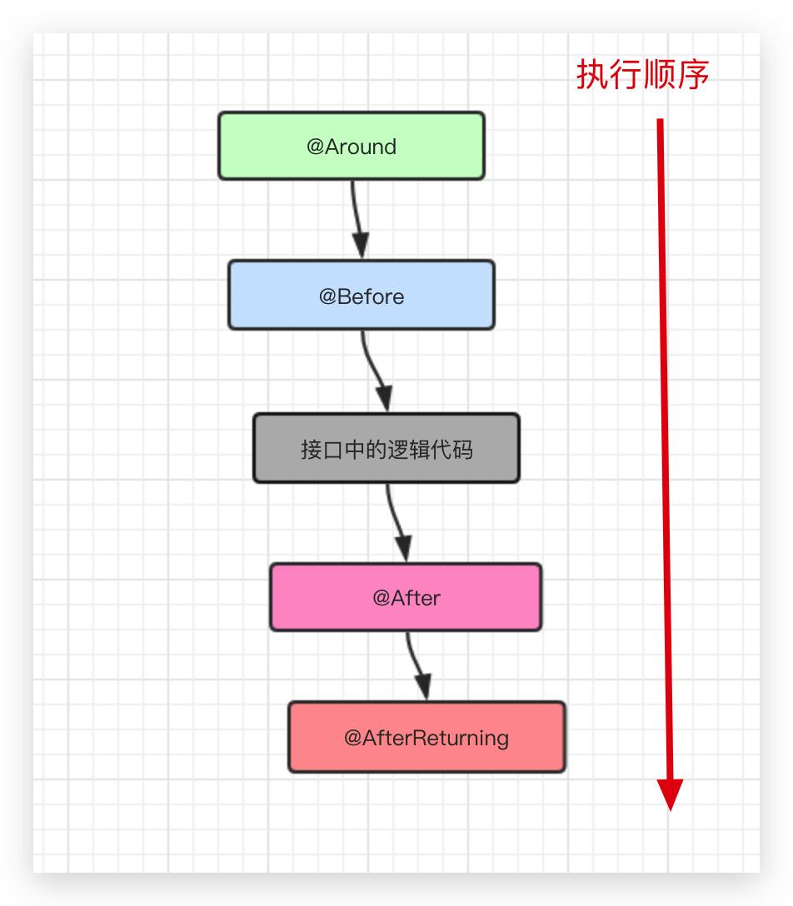
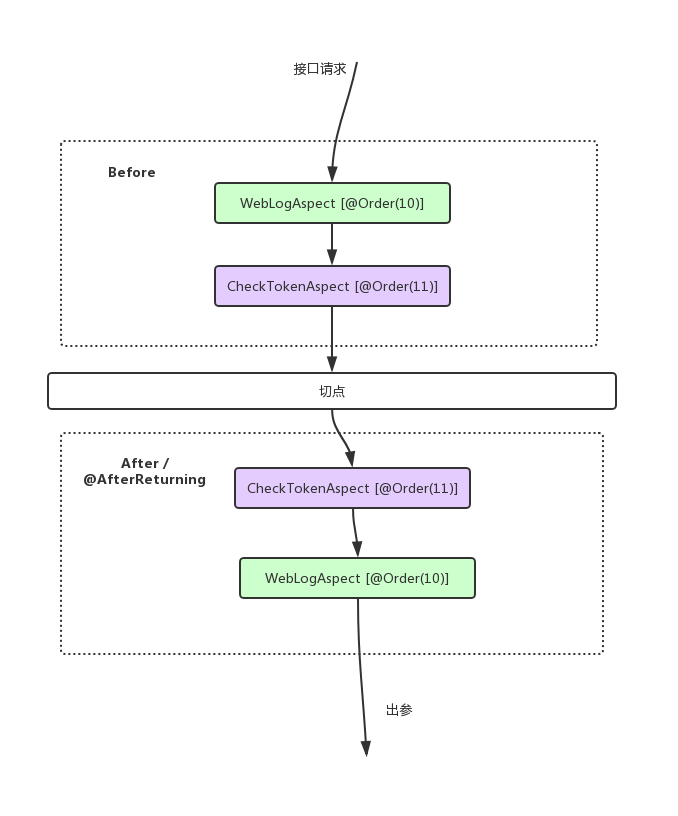

# spring-boot-starter-mail
# Spring Boot 自定义注解，AOP 切面统一打印出入参请求日志

在配置 AOP 切面之前，我们需要了解下 aspectj 相关注解的作用：
@Aspect：声明该类为一个注解类；
@Pointcut：定义一个切点，后面跟随一个表达式，表达式可以定义为切某个注解，也可以切某个 package 下的方法；
切点定义好后，就是围绕这个切点做文章了：

@Before: 在切点之前，织入相关代码；
@After: 在切点之后，织入相关代码;
@AfterReturning: 在切点返回内容后，织入相关代码，一般用于对返回值做些加工处理的场景；
@AfterThrowing: 用来处理当织入的代码抛出异常后的逻辑处理;
@Around: 环绕，可以在切入点前后织入代码，并且可以自由的控制何时执行切点；

###多切面如何指定优先级？
假设说我们的服务中不止定义了一个切面，比如说我们针对 Web 层的接口，不止要打印日志，还要校验 token 等。要如何指定切面的优先级呢？也就是如何指定切面的执行顺序？

我们可以通过 @Order(i)注解来指定优先级，注意：i 值越小，优先级则越高。

假设说我们定义上面这个日志切面的优先级为 @Order(10), 然后我们还有个校验 token 的切面 CheckTokenAspect.java，我们定义为了 @Order(11), 那么它们之间的执行顺序如下：

我们可以总结一下：
在切点之前，@Order 从小到大被执行，也就是说越小的优先级越高；
在切点之后，@Order 从大到小被执行，也就是说越大的优先级越高；
